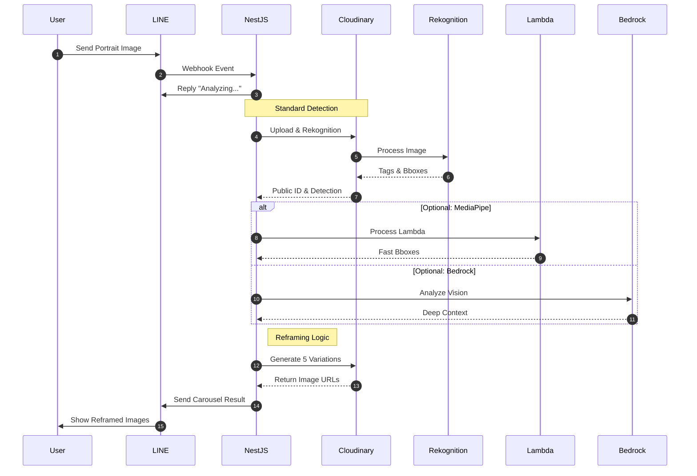

# Project Workflow 🔄

เอกสารอธิบายการทำงานของระบบ Reframe.AI ตั้งแต่เริ่มต้นจนจบ

## Mermaid Workflow Diagram

---

## ขั้นตอนการทำงานโดยละเอียด (Step-by-Step)

### 1. รับข้อมูลจากผู้ใช้
- **Chat Interface**: ผู้ใช้ส่งภาพถ่ายบุคคล (Portrait) เข้ามาใน LINE OA
- **Webhook**: LINE Platform ส่ง Event `message` ประเภท `image` มายัง NestJS `/chatbot/webhook`

### 2. เตรียมข้อมูลภาพ
- **Download**: ระบบดึงไฟล์ภาพจาก LINE Server แปลงเป็น Buffer
- **Feedback**: ระบบส่งข้อความตอบกลับเบื้องต้นเพื่อให้ผู้ใช้รู้ว่าระบบกำลังทำงาน

### 3. ตรวจจับวัตถุและบุคคล (AI Object Detection)
ระบบรองรับ 3 รูปแบบ (Default คือ Rekognition):
- **Amazon Rekognition (Cloudinary Add-on)**: ระบุได้ว่าบุคคลอยู่ตรงไหน (Bbox) และมีสิ่งของอะไรบ้างในภาพ
- **AWS Lambda**: ประมวลผลด้วย MediaPipe เพื่อความเร็วสูงในการหาพิกัด
- **Amazon Bedrock**: วิเคราะห์อารมณ์และบริบทเพื่อการจัดองค์ประกอบที่ลึกซึ้ง

### 4. จัดองค์ประกอบภาพใหม่ (Reframing Logic)
- **Calculation**: ใช้ข้อมูลพิกัด (Bounding Boxes) เพื่อหาจุดกึ่งกลางของบุคคล
- **Rule of Thirds**: คำนวณจุดตัด 9 ช่อง (Power Points)
- **Cloudinary Transformations**: ส่งคำสั่ง `crop`, `gravity:auto:person`, และ `zoom` เพื่อสร้างภาพใหม่ 5-6 แบบ

### 5. แสดงผลลัพธ์
- **Carousel Response**: ส่งภาพ Reframe ทั้งหมดกลับไปให้ผู้ใช้ในรูปแบบ Carousel
- **Interactive UI**: ผู้ใช้สามารถกดดูภาพเต็มหรือเลือกภาพที่ถูกใจได้
