# Project Workflow 🔄

เอกสารอธิบายการทำงานของระบบ Reframe.AI ตั้งแต่เริ่มต้นจนจบ

## Mermaid Workflow Diagram

```mermaid
sequenceDiagram
    participant U as User (LINE App)
    participant L as LINE Platform
    participant N as NestJS Backend
    participant C as Cloudinary API
    participant R as AWS Rekognition (Add-on)
    participant W as AWS Lambda (MediaPipe)
    participant B as Amazon Bedrock (Vision)

    U->>L: ส่งรูปภาพ Portrait
    L->>N: Webhook (Image Message)
    
    N->>L: ส่งข้อความ "Analyzing photo..."
    N->>L: ดึงข้อมูล Image Binary
    
    rect rgb(240, 240, 240)
        Note right of N: Process Image
        N->>C: Upload & Execute Add-ons (Default)
        C->>R: เรียกใช้ Rekognition Tag/Detect
        R-->>C: ส่งคืนข้อมูล Tags & Bboxes
        C-->>N: ส่งคืน Public ID + Detection Data
    end

    alt Optional Detection
        N->>W: (Optional) เรียกใช้ Lambda + MediaPipe
        W-->>N: ส่งคืนแม่นยำ Bboxes (TFLite)
    else Advanced AI
        N->>B: (Optional) เรียกใช้ Bedrock (Claude 3 Vision)
        B-->>N: ส่งคืนเชิงบรรยาย (Description)
    end

    Note right of N: Image Reframing (Rule of Thirds)
    N->>C: สร้าง 5 Variations (Transforms)
    C-->>N: ส่งคืน 5 Image URLs

    N->>L: ตอบกลับด้วย Flex Message/Carousel
    L->>U: แสดงผลภาพที่ Reframe แล้ว
```

---

## ขั้นตอนการทำงานโดยละเอียด (Step-by-Step)

### 1. รับข้อมูลจากผู้ใช้
- **Chat Interface**: ผู้ใช้ส่งภาพถ่ายบุคคล (Portrait) เข้ามาใน LINE OA
- **Webhook**: LINE Platform ส่ง Event `message` ประเภท `image` มายัง NestJS `/chatbot/webhook`

### 2. เตรียมข้อมูลภาพ
- **Download**: ระบบดึงไฟล์ภาพจาก LINE Server แปลงเป็น Buffer
- **Feedback**: ระบบส่งข้อความตอบกลับเบื้องต้นเพื่อให้ผู้ใช้รู้ว่าระบบกำลังทำงาน

### 3. ตรวจจับวัตถุและบุคคล (AI Object Detection)
ระบบรองรับ 3 รูปแบบ (Default คือ Rekognition):
- **Amazon Rekognition (Cloudinary Add-on)**: ระบุได้ว่าบุคคลอยู่ตรงไหน (Bbox) และมีสิ่งของอะไรบ้างในภาพ
- **AWS Lambda**: ประมวลผลด้วย MediaPipe เพื่อความเร็วสูงในการหาพิกัด
- **Amazon Bedrock**: วิเคราะห์อารมณ์และบริบทเพื่อการจัดองค์ประกอบที่ลึกซึ้ง

### 4. จัดองค์ประกอบภาพใหม่ (Reframing Logic)
- **Calculation**: ใช้ข้อมูลพิกัด (Bounding Boxes) เพื่อหาจุดกึ่งกลางของบุคคล
- **Rule of Thirds**: คำนวณจุดตัด 9 ช่อง (Power Points)
- **Cloudinary Transformations**: ส่งคำสั่ง `crop`, `gravity:auto:person`, และ `zoom` เพื่อสร้างภาพใหม่ 5-6 แบบ

### 5. แสดงผลลัพธ์
- **Carousel Response**: ส่งภาพ Reframe ทั้งหมดกลับไปให้ผู้ใช้ในรูปแบบ Carousel
- **Interactive UI**: ผู้ใช้สามารถกดดูภาพเต็มหรือเลือกภาพที่ถูกใจได้
